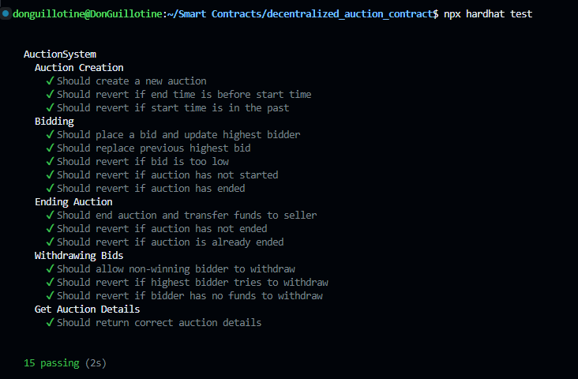

# AuctionSystem Smart Contract

AuctionSystem is a decentralized auction platform built on Ethereum. It allows users to create time-bound auctions, place bids, and automatically manages the auction lifecycle including bid placement, auction closing, and fund distribution.

## Features

- Create time-bound auctions with specified start and end times
- Place bids on active auctions
- Automatic handling of highest bid updates
- Secure withdrawal mechanism for non-winning bidders
- Automatic transfer of winning bid to the seller upon auction completion
- Comprehensive event logging for frontend integration
- Gas-optimized operations using modern Solidity patterns

## Technology Stack

- Solidity 0.8.24
- Hardhat Development Environment
- OpenZeppelin Contracts 5.0.0
- Ethers.js 6.x
- Chai for testing

## Prerequisites

- Node.js v14.x or later
- npm 6.x or later
- An Ethereum wallet with Sepolia testnet ETH for deployment

## Installation

1. Clone the repository:
   ```
   git clone https://github.com/DonGuillotine/decentralized-auction-contract.git
   cd decentralized-auction-contract
   ```

2. Install dependencies:
   ```
   npm install
   ```

3. Create a `.env` file in the root directory with the following content:
   ```
   LISK_SEPOLIA_RPC_URL=your_rpc.sepolia-api_key
   PRIVATE_KEY=your_ethereum_private_key
   ETHERSCAN_API_KEY=your_etherscan_api_key
   ```

## Usage

### Compile Contracts

```
npx hardhat compile
```

### Run Tests

```
npx hardhat test
```
#### All Tests Passed



### Deploy to Sepolia Testnet

```
npx hardhat run scripts/deploy.js --network lisk-sepolia
```

This script will deploy the contract and automatically verify it on Etherscan.

## Contract Interface

### Functions

1. `createAuction(uint256 _startTime, uint256 _endTime)`: Create a new auction
2. `placeBid(uint256 _auctionId)`: Place a bid on an active auction
3. `endAuction(uint256 _auctionId)`: End an auction after its end time
4. `withdrawBid(uint256 _auctionId)`: Withdraw a non-winning bid
5. `getAuctionDetails(uint256 _auctionId)`: Get details of a specific auction

### Events

1. `AuctionCreated(uint256 indexed auctionId, address indexed seller, uint256 startTime, uint256 endTime)`
2. `BidPlaced(uint256 indexed auctionId, address indexed bidder, uint256 amount)`
3. `AuctionEnded(uint256 indexed auctionId, address winner, uint256 amount)`
4. `WithdrawalMade(uint256 indexed auctionId, address indexed bidder, uint256 amount)`

## Security Considerations

- The contract uses OpenZeppelin's `ReentrancyGuard` to prevent reentrancy attacks
- Time-based operations use `block.timestamp`, which can be slightly manipulated by miners (maximum of a few seconds)
- The contract has been thoroughly tested, but we recommend a professional audit before mainnet deployment

## Gas Optimization

- Utilizes mappings for efficient data storage and retrieval
- Implements checks-effects-interactions pattern to prevent reentrancy
- Uses custom errors for gas-efficient error handling

## Testing

The contract includes a comprehensive test suite covering various scenarios including:
- Auction creation
- Bidding mechanics
- Auction ending
- Bid withdrawals
- Edge cases and error conditions

Run the tests using the command mentioned in the Usage section.

## Deployment

The deployment script (`scripts/deploy.js`) handles:
1. Contract deployment to the Sepolia testnet
2. Waiting for block confirmations
3. Automatic contract verification on Etherscan

## Contributing

Contributions are welcome! Please feel free to submit a Pull Request.

## License

This project is licensed under the MIT License - see the [LICENSE.md](LICENSE.md) file for details.

## Contact

For any queries or support, please open an issue in the GitHub repository.